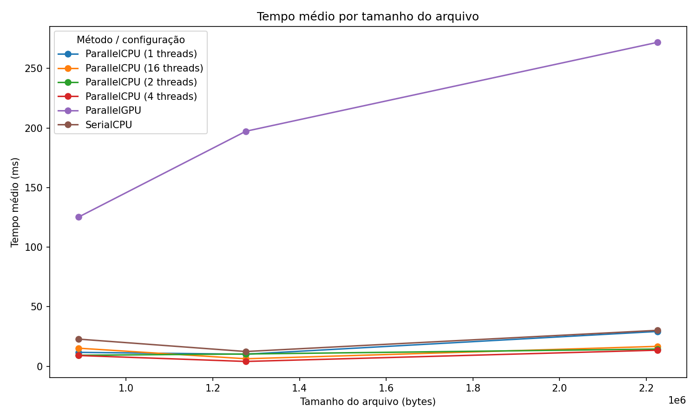

# Análise comparativa de algoritmos com uso de paralelismo

Autor(a): Janylson Filho - 2320300; Ulisses Magalhães - 2320436  
Disciplina: Computação Paralela e Concorrente

Palavras-chave: paralelismo, concorrência, Java, OpenCL, JOCL, Jupyter Notebook, benchmark, contagem de palavras.

---

## Resumo

Este projeto realiza uma análise comparativa entre três estratégias de contagem de palavras em arquivos de texto usando Java:

- **SerialCPU**: execução serial na CPU.
- **ParallelCPU**: execução paralela na CPU com `ExecutorService` e pool de threads.
- **ParallelGPU**: execução paralela na GPU com OpenCL usando a biblioteca JOCL.

O Java executa os testes e gera os arquivos CSV. A análise estatística e os gráficos são feitos no **Jupyter Notebook**, que gera imagens `.png` para inclusão no relatório.

Foram utilizados três arquivos de entrada:

- `Dracula-165307.txt`
- `MobyDick-217452.txt`
- `DonQuixote-388208.txt`

Para cada arquivo, cada método foi executado 3 vezes. Na versão `ParallelCPU`, também foram testadas diferentes quantidades de threads: `1`, `2`, `4` e `16`.

---

## Estrutura do projeto

```text
projeto-paralelismo/
├── src/
│   └── WordCounterBenchmark.java
├── data/
│   ├── Dracula-165307.txt
│   ├── MobyDick-217452.txt
│   └── DonQuixote-388208.txt
├── lib/
│   └── jocl-2.0.4.jar
├── results/
│   ├── resultados.csv
│   ├── resumo_estatistico.csv
│   └── speedup.csv
├── images/
│   ├── grafico_tempo_por_tamanho_arquivo.png
│   ├── grafico_tempo_medio_por_metodo_e_arquivo.png
│   ├── grafico_parallelcpu_threads.png
│   └── grafico_speedup.png
├── analise_graficos_jupyter.ipynb
├── requirements.txt
├── compile.sh
├── run.sh
├── compile.bat
└── run.bat
```

---

## Requisitos

### Java

É necessário ter o **JDK** instalado, não apenas o JRE.

No Linux, é possível instalar com:

```bash
sudo apt update
sudo apt install openjdk-21-jdk
```

Verifique com:

```bash
javac -version
```

### Python e Jupyter

É recomendado usar ambiente virtual:

```bash
python3 -m venv .venv
source .venv/bin/activate
pip install -r requirements.txt
```

O arquivo `requirements.txt` deve conter:

```text
notebook
pandas
matplotlib
```

### GPU / OpenCL

Para executar a versão `ParallelGPU`, a máquina precisa ter suporte a OpenCL.

No Linux, é possível verificar com:

```bash
clinfo
```

No ambiente usado para os testes, a GPU foi reconhecida como:

```text
NVIDIA GeForce RTX 3050 6GB Laptop GPU
OpenCL 3.0 CUDA
```

A biblioteca `jocl-2.0.4.jar` deve permanecer dentro da pasta `lib/`.

---

## Como executar o projeto

### 1. Executar o benchmark Java

No Linux/macOS:

```bash
chmod +x compile.sh run.sh
./run.sh the
```

No Windows:

```bat
run.bat the
```

A palavra `the` pode ser substituída por outra palavra:

```bash
./run.sh whale
```

Ao final da execução, será gerado:

```text
results/resultados.csv
```

Esse CSV contém as colunas:

```text
arquivo,tamanho_bytes,palavra,metodo,threads,repeticao,ocorrencias,tempo_ms
```

### 2. Gerar os gráficos no Jupyter Notebook

Com o ambiente virtual ativado:

```bash
source .venv/bin/activate
jupyter notebook
```

Abra o arquivo:

```text
analise_graficos_jupyter.ipynb
```

Depois execute:

```text
Kernel > Restart Kernel and Run All Cells
```

O notebook gera:

```text
results/resumo_estatistico.csv
results/speedup.csv
images/*.png
```

---

## Metodologia

O benchmark foi feito em duas etapas.

Na primeira etapa, o programa Java executa a contagem da palavra nos três arquivos `.txt`. Cada método é executado 3 vezes para gerar amostras suficientes para análise. A versão `ParallelCPU` é testada com 1, 2, 4 e 16 threads. A versão `ParallelGPU` utiliza OpenCL com JOCL para executar a busca em uma GPU compatível.

Na segunda etapa, o Jupyter Notebook lê o arquivo `results/resultados.csv`, calcula médias, desvios, mínimos, máximos e speedup. Os gráficos são exportados em formato `.png`.

O speedup foi calculado por:

```text
speedup = tempo médio SerialCPU / tempo médio do método paralelo
```

Valores maiores que `1` indicam ganho em relação à versão serial. Valores menores que `1` indicam que a versão paralela foi mais lenta.

---

## Resultados e discussão

A execução gerou 54 registros no arquivo `resultados.csv`.

Esse número é esperado porque foram executados:

```text
3 arquivos × 18 execuções por arquivo = 54 execuções
```

Para cada arquivo:

```text
SerialCPU: 3 execuções
ParallelCPU: 4 configurações × 3 execuções = 12 execuções
ParallelGPU: 3 execuções
Total: 18 execuções
```

O arquivo `resumo_estatistico.csv` possui 18 linhas, correspondendo a:

```text
3 arquivos × 6 configurações
```

As configurações analisadas foram:

- `SerialCPU`
- `ParallelCPU (1 thread)`
- `ParallelCPU (2 threads)`
- `ParallelCPU (4 threads)`
- `ParallelCPU (16 threads)`
- `ParallelGPU`

O arquivo `speedup.csv` possui 15 linhas, pois compara apenas as versões paralelas com a `SerialCPU`:

```text
3 arquivos × 5 configurações paralelas = 15 linhas
```

---

## Gráfico 1 — Tempo médio por tamanho do arquivo



Esse gráfico mostra a relação entre o tamanho do arquivo e o tempo médio de execução de cada configuração.

A versão `ParallelGPU` apresentou os maiores tempos médios. Isso ocorreu porque, embora a GPU tenha alto poder de paralelismo, existe um custo adicional para inicializar o OpenCL, criar contexto, criar buffers, transferir dados entre CPU e GPU e recuperar os resultados.

Para os tamanhos de entrada usados neste trabalho, esse overhead foi maior que o ganho obtido com a execução paralela na GPU.

A versão `ParallelCPU`, principalmente com 4 e 16 threads, teve os menores tempos. Isso mostra que a divisão do texto entre múltiplas threads foi eficiente para esse problema.

---

## Gráfico 2 — Tempo médio por método e arquivo


Esse gráfico compara diretamente todos os métodos em cada arquivo.

Observa-se que a `SerialCPU` teve desempenho intermediário. Ela foi mais rápida que a GPU, mas mais lenta que as melhores configurações da CPU paralela.

A configuração `ParallelCPU (1 thread)` ficou próxima ou pior que a versão serial. Isso é esperado, pois ela usa a estrutura de paralelismo, mas sem ganho real de divisão entre múltiplos núcleos. Nesse caso, o overhead de criação e gerenciamento das tarefas pode prejudicar o desempenho.

As configurações `ParallelCPU (4 threads)` e `ParallelCPU (16 threads)` apresentaram os melhores resultados gerais.

---

## Gráfico 3 — ParallelCPU por quantidade de threads


Esse gráfico mostra apenas a versão `ParallelCPU`, variando o número de threads.

O comportamento observado foi coerente com o esperado: ao aumentar o número de threads, o tempo médio diminuiu. O ganho foi mais visível no arquivo `DonQuixote`, que é o maior arquivo de entrada.

Isso indica que textos maiores se beneficiam mais da divisão do trabalho entre várias threads, porque há mais dados para distribuir entre os núcleos da CPU.

Também é possível observar que o ganho não cresce de forma perfeitamente linear. Isso acontece porque existem custos de criação, escalonamento, sincronização e combinação dos resultados das threads.

---

## Gráfico 4 — Speedup das versões paralelas


O gráfico de speedup compara cada versão paralela com a `SerialCPU`.

A linha tracejada em `speedup = 1` representa o desempenho da versão serial:

- Acima de `1`: a versão paralela foi mais rápida que a serial.
- Abaixo de `1`: a versão paralela foi mais lenta que a serial.

As versões `ParallelCPU (4 threads)` e `ParallelCPU (16 threads)` apresentaram os melhores speedups. Isso confirma que o paralelismo em CPU foi a melhor estratégia para os arquivos testados.

A versão `ParallelGPU` ficou abaixo de `1`, ou seja, foi mais lenta que a serial. Isso não significa que a GPU esteja incorreta. Significa que, para essa carga de trabalho e esses tamanhos de entrada, o custo de preparação da execução na GPU superou o benefício do paralelismo.

---

## Conclusão

Os resultados mostram que o paralelismo pode melhorar bastante o desempenho, mas isso depende da estratégia utilizada e do tamanho da entrada.

A melhor abordagem neste trabalho foi a **ParallelCPU com múltiplas threads**, principalmente com 4 e 16 threads. Essa versão reduziu o tempo médio de execução e apresentou speedup superior à versão serial.

A **SerialCPU** teve desempenho razoável e serviu como base de comparação. Por ser simples e não possuir overhead de gerenciamento paralelo, ela ainda pode ser competitiva em entradas menores.

A **ParallelGPU** executou corretamente usando OpenCL/JOCL, mas apresentou tempos maiores que as versões em CPU. O principal motivo foi o overhead de inicialização do OpenCL, criação de contexto, alocação de buffers e transferência de dados. Para arquivos pequenos e médios, esse custo pode ser maior do que o ganho obtido pela GPU.

Portanto, a principal conclusão é que **usar paralelismo não garante automaticamente melhor desempenho**. Para este problema de contagem de palavras, nos arquivos testados, o paralelismo em CPU foi mais eficiente que a GPU.

---

## Referências

- ORACLE. Java Documentation. Disponível em: https://docs.oracle.com/en/java/
- JOCL. Java bindings for OpenCL. Disponível em: http://www.jocl.org/
- KHRONOS GROUP. OpenCL Overview. Disponível em: https://www.khronos.org/opencl/
- Project Jupyter. Disponível em: https://jupyter.org/
- GOETZ, Brian et al. *Java Concurrency in Practice*. Boston: Addison-Wesley, 2006.
- TANENBAUM, Andrew S.; BOS, Herbert. *Modern Operating Systems*.

---

## Anexos — Códigos das implementações

Os códigos principais estão em:

```text
src/WordCounterBenchmark.java
analise_graficos_jupyter.ipynb
```

O arquivo `WordCounterBenchmark.java` contém as implementações dos três métodos:

```java
SerialCPU(Path arquivoTxt, String palavra)
ParallelCPU(Path arquivoTxt, String palavra, int numeroThreads)
ParallelGPU(Path arquivoTxt, String palavra)
```

O notebook Jupyter contém a análise estatística e a geração dos gráficos em PNG.

---

